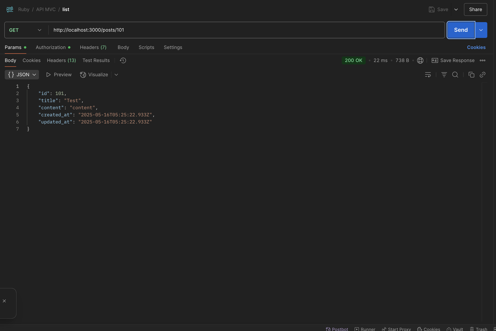
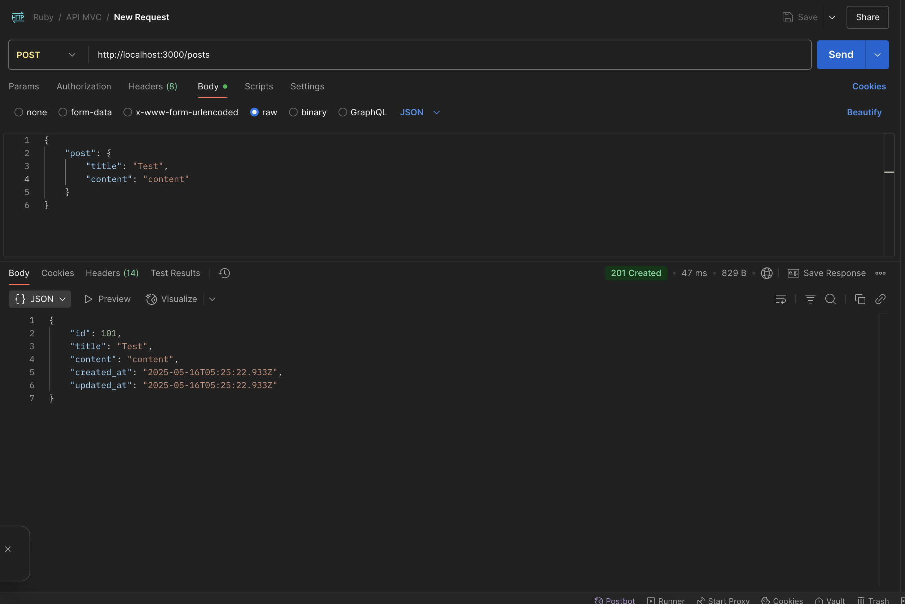
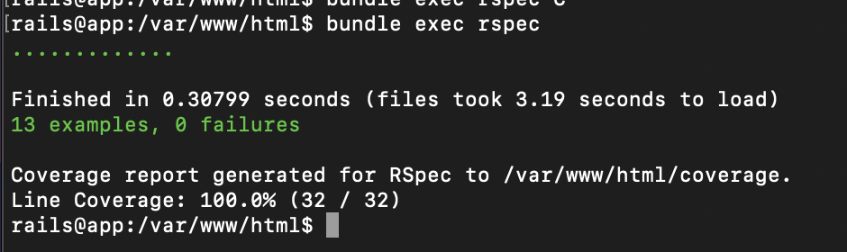
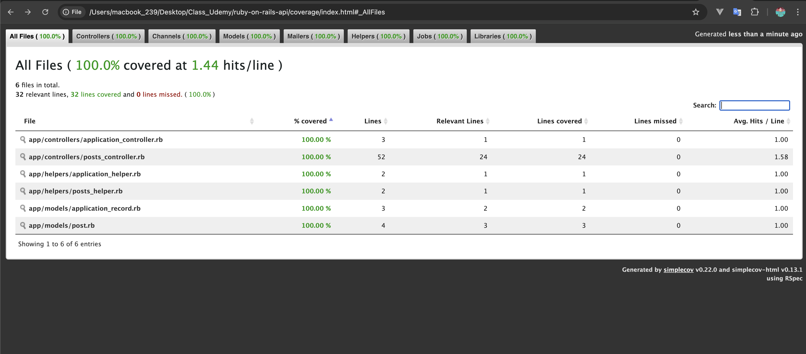

# Development Environment Setup

## Installation & Setup

1. Build Docker containers:
```bash
docker-compose build
```

2. Start containers:
```bash
docker-compose up -d
```

3. Access the app container:
```bash
docker exec -it ruby_app bash
```
4. Setup database and run migrations:
```bash
rails db:create
rails db:migrate
rails db:seed
```

---

## API Documentation

| Method | Endpoint         | Description |
|--------|------------------|-------------|
| POST   | /api/v1/posts     | Create a new post |
| GET    | /api/v1/posts     | Get all posts |
| GET    | /api/v1/posts/:id | Get a post by ID |
| PATCH  | /api/v1/posts/:id | Update a post by ID |
| DELETE | /api/v1/posts/:id | Delete a post by ID |





## Testing

1. Run tests:
```bash
bundle exec rspec
```


2. Run tests with coverage:
```bash
open coverage/index.html
```
